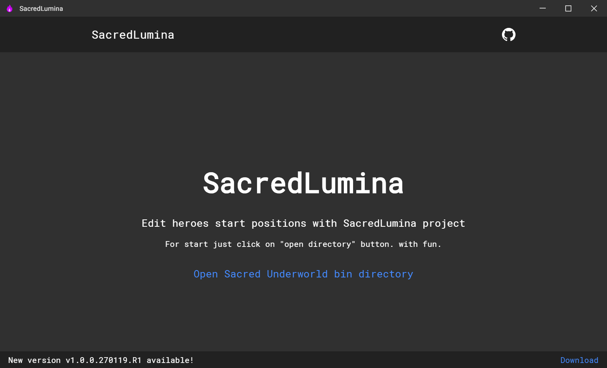
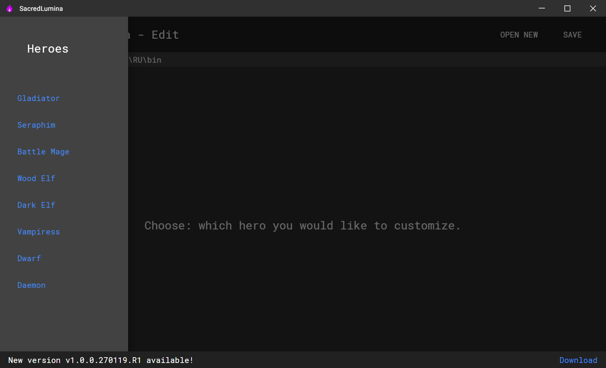
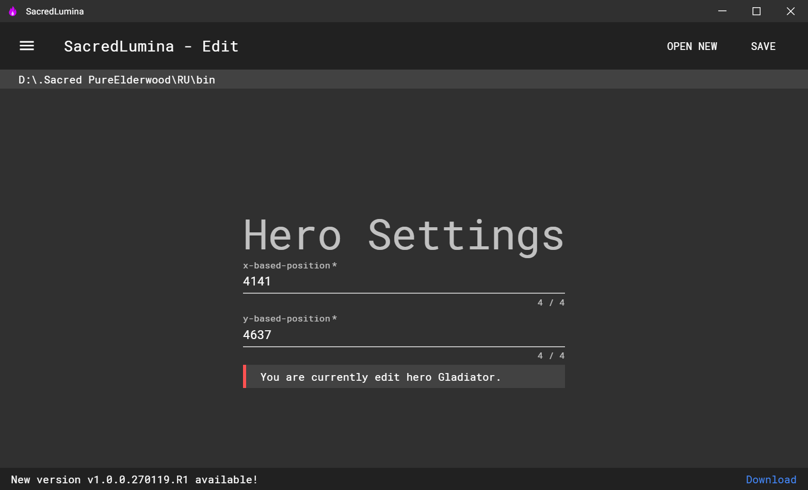
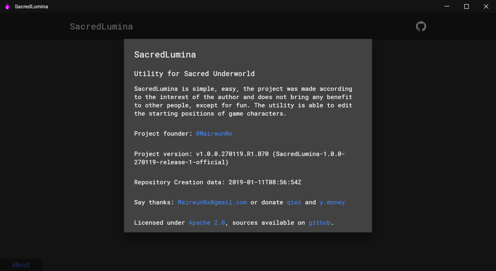

# SacredLumina
Smart and fast hero start-pos editor for Sacred and Sacred Underworld

# Requirements

 * Windows 7, 8, 8.1, 10. Arch: x32 or x64.
 * Administrator rules if application work with folders in UAC secure folders.
 * 2.28 Sacred Underworld!!! Modifications not supported!!! Only Steam version!!!

# Features

 * IS! OpenSource Project! No privacy, and it opportunity to improve!
 * Writed on new web framework VueJS with using JavaScript, HTML and CSS.
 * Constant support and updates, bug fixes, help with editing pos files.
 * Ability to changing game hero start spawn positions in world!
 
# Downloads

 * Download the source and run the SacredLumina (Electron 4.0.X, Vue CLI 3.X, ES6 is reqired).
 * Download a pre-compiled SacredLumina from the [releases](https://github.com/MairwunNx/SacredLumina/releases) page.

# Run with sources

 * Install node.js from official site, intstall npm.
 * Clone this repository and unarchive in some folder.
 * Hold Shift and right click in folder with sources > open powershell here.
 * Type in console \ ps "npm i" and wait some time.
 * After installation type "npm run electron:serve" - for run.
  
# Change Log

 * See SacredLumina change log [here](https://github.com/MairwunNx/SacredLumina/blob/master/CHANGELOG.md) (latest version above change log page).

# Want to say thanks?

 * Hit the star button or say thanks message to MairwunNx@gmail.com .
 * May be... Donate please :) [QIWI](https://qiwi.me/mairwunnx) or [Yandex.Money](https://money.yandex.ru/to/410015993365458)..
 
# Special thanks

 * Special thanks to JetBrains for the free student license! Use wonderful products by JetBrains!

# Screenshots

## Thanks for using SacredLumina! Maded with ❤, please click on ★!